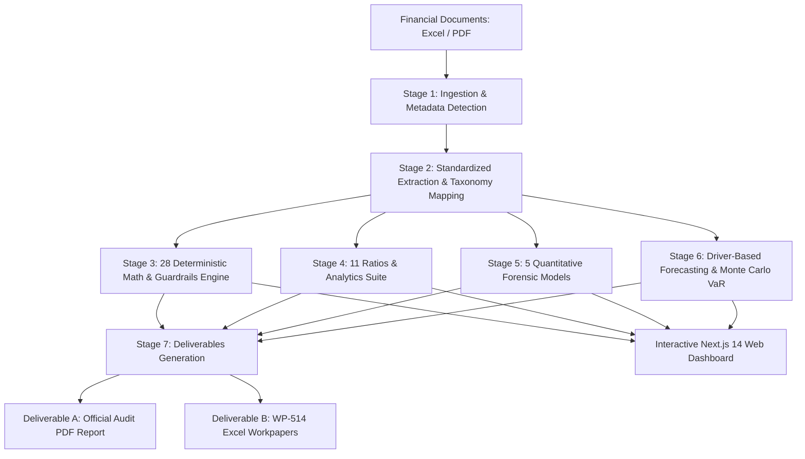

# Financial Statement Review & Risk Analytics System (FSRA)


**FSRA (Financial Statement Review & Risk Analytics System)** is an enterprise-grade financial auditing, verification, and forensic risk intelligence platform. It automates ingestion of corporate financial statements (Excel/PDF), performs deterministic mathematical footing checks, evaluates quantitative forensic models (Altman Z, Beneish M, Benford's Law, Sloan Accruals, DuPont), runs stochastic forecasting simulations (Monte Carlo), and produces official audit workpapers (`.xlsx`) and assurance reports (`.pdf`).

---

## 🏛️ System Architecture



---

## 🚀 Key Features

### 1. Document Ingestion & Extraction Engine
- **Multi-Format Ingestion**: Supports `.xlsx`, `.xls`, `.xlsm`, and native text/table `.pdf` files.
- **Batch Drag-and-Drop**: Multi-file select and batch upload queue for complete document packages (Balance Sheets, Income Statements, Cash Flows, Notes).
- **Taxonomy Normalization**: Fuzzy taxonomy mapping that reconciles disparate naming conventions to standardized GAAP/IFRS statement structures.

### 2. Audit Verification & Footing Rules Suite
- **28 Deterministic Math Rules**:
  - Balance sheet equilibrium ($Assets = Liabilities + Equity$)
  - Working capital footing
  - Gross profit, operating income, and net income reconciliation
  - Cross-statement cash tie-outs ($CFS \text{ Ending Cash} = BS \text{ Cash}$)
  - Retained earnings roll-forward
  - Prior year asset/liability continuity
  - Footnote debt and allowance reconciliations
- **Input Guardrails**: Negative revenue checks, negative cash balance sanity checks, and provision ratio flags.

### 3. Comprehensive Analytics & 11 Ratios Suite
- **Liquidity & Solvency**: Current Ratio, Quick Ratio (Acid-Test), Debt-to-Equity, Interest Coverage.
- **Activity & Working Capital Cycle**: Days Sales Outstanding (DSO), Days Inventory Outstanding (DIO), Days Payable Outstanding (DPO), and Cash Conversion Cycle (CCC).
- **Profitability & Margins**: Gross Profit Margin, Operating Margin, Effective Tax Rate, Net Margin.
- **7 Interactive Visualizations**: Plotly-powered high-contrast financial charts.

### 4. Forensic Accounting & Anomaly Models
- **Altman Z-Score**: 5-factor credit strength and bankruptcy probability index.
- **Beneish M-Score**: 8-variable earnings manipulation and fraud detection algorithm.
- **Sloan Accrual Ratio**: Cash flow quality vs. accounting accruals.
- **3-Stage DuPont Decomposition**: Return on Equity (ROE) split across Net Margin, Asset Turnover, and Equity Multiplier.
- **Benford's Law**: First-digit frequency distribution analysis vs. $\log_{10}(1 + 1/d)$ curve to detect artificial number fabrication.

### 5. Forecasting & Monte Carlo Simulation
- **Driver-Based Operational Projections**: ARPU, unit expansion, and cost structure forecasting.
- **5,000-Run Stochastic Simulation**: Revenue and cash flow trajectory forecasting with 95% Value-at-Risk (VaR) confidence bounds.

### 6. Official Audit Deliverables
- **Deliverable A**: Official Executive Audit Assurance Report (`.pdf` via ReportLab).
- **Deliverable B**: WP-514 Standardized Audit Workpaper Workbook (`.xlsx` via XlsxWriter).

---

## 📂 Project Structure

```text
FSRA/
├── backend/
│   ├── app/
│   │   ├── api/             # FastAPI REST endpoints (clients, projects, files, audit)
│   │   ├── core/            # Configuration and environment settings
│   │   ├── schemas/         # Pydantic request/response models
│   │   ├── services/        # Business logic and database adapters
│   │   └── main.py          # FastAPI application entry point
│   ├── src/
│   │   ├── analytics/       # 11 ratios, trend analytics, and DuPont engine
│   │   ├── extraction/      # Statement parsing and taxonomy normalization
│   │   ├── ingestion/       # Multi-format Excel & PDF parser orchestrator
│   │   ├── reporting/       # PDF ReportLab and Excel XlsxWriter generators
│   │   ├── schemas/         # Standard statement and manifest definitions
│   │   └── verification/    # 28 deterministic math rules & forensic models
│   └── requirements.txt     # Python backend dependencies
├── frontend/
│   ├── src/
│   │   ├── app/             # Next.js 14 App Router pages
│   │   │   ├── login/       # Client authentication & tenant selection
│   │   │   ├── projects/    # Engagement management & project creation (2a)
│   │   │   │   └── [id]/    # Ingestion staging (Screen 3) & Dashboard (Screen 5)
│   │   ├── components/      # React components (Plotly charts, uploaders, modals)
│   │   └── lib/             # API clients, TanStack query hooks, and types
│   ├── package.json         # Node.js frontend dependencies
│   └── tailwind.config.js   # Tailwind CSS configuration
├── audit_output/            # Generated PDF reports and Excel workbooks
├── sample_audit_input.xlsx  # Sample multi-tab audit workbook
├── main.py                  # Standalone CLI runner for headless audit pipelines
└── README.md                # Project documentation
```

---

## ⚡ Quickstart Guide

### Prerequisites
- **Python**: `3.10+`
- **Node.js**: `18.17+` (or `20+`)
- **Package Managers**: `pip` and `npm`

---

### 1. Backend Setup

1. **Navigate to the backend directory and set up a virtual environment**:
   ```bash
   cd backend
   python -m venv venv
   ```

2. **Activate the virtual environment**:
   - **Windows**:
     ```powershell
     .\venv\Scripts\Activate.ps1
     ```
   - **Linux / macOS**:
     ```bash
     source venv/bin/activate
     ```

3. **Install dependencies**:
   ```bash
   pip install -r requirements.txt
   ```

4. **Configure Environment Variables** (Optional / Default provided):
   Create a `.env` file in `backend/` or utilize the defaults:
   ```env
   SUPABASE_URL=your_supabase_url
   SUPABASE_KEY=your_supabase_anon_key
   ```

5. **Start the FastAPI Backend Server**:
   ```bash
   uvicorn app.main:app --reload --host 0.0.0.0 --port 8000
   ```
   API interactive documentation will be accessible at `http://localhost:8000/docs`.

---

### 2. Frontend Setup

1. **Navigate to the frontend directory**:
   ```bash
   cd ../frontend
   ```

2. **Install Node.js dependencies**:
   ```bash
   npm install
   ```

3. **Start the Next.js Development Server**:
   ```bash
   npm run dev
   ```

4. **Access the Application**:
   Open your browser and navigate to `http://localhost:3000`.

---

### 3. Standalone CLI Audit Runner

You can also run the audit pipeline headlessly via the command-line interface:

```bash
# Run with the auto-generated sample financial statement
python main.py

# Run with custom Excel and PDF financial statements
python main.py path/to/financials.xlsx path/to/notes.pdf --output_dir audit_output --client_name "Acme_Corp"
```

---

## 🔌 API Endpoints Reference

| Method | Endpoint | Description |
|---|---|---|
| `GET` | `/api/v1/clients` | Retrieve list of clients |
| `POST` | `/api/v1/clients` | Create a new client entity |
| `GET` | `/api/v1/projects` | List all engagement projects |
| `POST` | `/api/v1/projects` | Create a new audit engagement |
| `GET` | `/api/v1/projects/{id}` | Get engagement project details |
| `PUT` | `/api/v1/projects/{id}` | Update audit project details |
| `DELETE` | `/api/v1/projects/{id}` | Delete an engagement project |
| `POST` | `/api/v1/projects/{id}/files` | Upload financial document (`.xlsx`, `.pdf`) |
| `GET` | `/api/v1/projects/{id}/files` | List staged documents for engagement |
| `DELETE` | `/api/v1/files/{file_id}` | Remove a staged document |
| `POST` | `/api/v1/projects/{id}/run-audit` | Execute the 7-Stage Audit Intelligence Pipeline |
| `GET` | `/api/v1/projects/{id}/results` | Fetch verification rules, ratios, forensics & deliverables |

---

## 🧪 Running Tests

```bash
# Run backend pytest suite
pytest -v
```

---

## 📄 License

This project is proprietary and confidential. All rights reserved © 2026 FSRA Systems.
